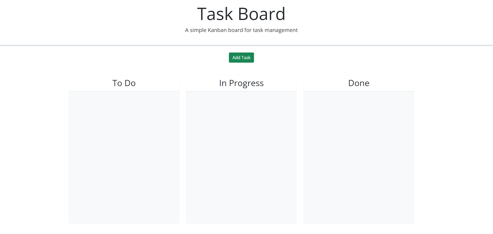
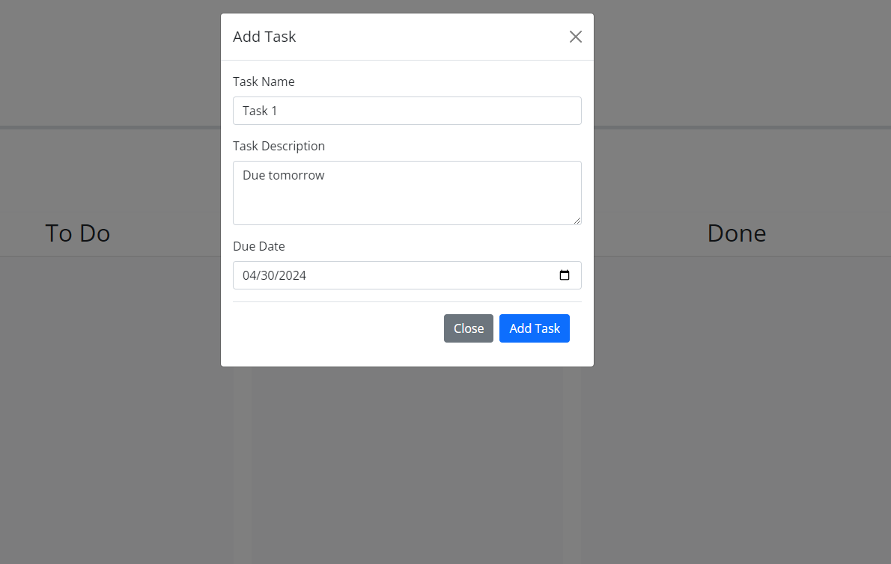
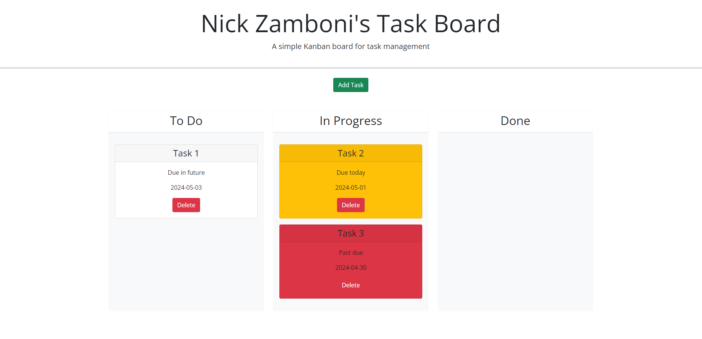
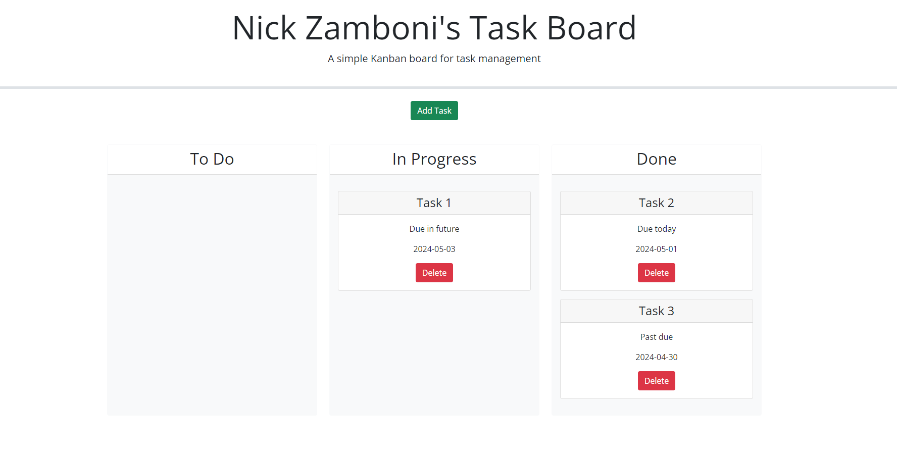

# 05 Third-Party APIs: Task Board

https://ndzamboni.github.io/challenge-5/

https://github.com/ndzamboni/challenge-5

## Your Task

Create a simple task board application that allows a team to manage project tasks by modifying starter code. This app will run in the browser and feature dynamically updated HTML and CSS powered by jQuery.

You'll need to use the [Day.js](https://day.js.org/en/) library to work with dates. Be sure to read the documentation carefully and concentrate on using Day.js in the browser.


 
 
 

## User Story

```md
AS A project team member with multiple tasks to organize
I WANT a task board 
SO THAT I can add individual project tasks, manage their state of progress and track overall project progress accordingly
```

## Acceptance Criteria

```md
GIVEN a task board to manage a project
WHEN I open the task board
THEN the list of project tasks is displayed in columns representing the task progress state (Not Yet Started, In Progress, Completed)
WHEN I view the task board for the project
THEN each task is color coded to indicate whether it is nearing the deadline (yellow) or is overdue (red)
WHEN I click on the button to define a new task
THEN I can enter the title, description and deadline date for the new task into a modal dialog
WHEN I click the save button for that task
THEN the properties for that task are saved in localStorage
WHEN I drag a task to a different progress column
THEN the task's progress state is updated accordingly and will stay in the new column after refreshing
WHEN I click the delete button for a task
THEN the task is removed from the task board and will not be added back after refreshing
WHEN I refresh the page
THEN the saved tasks persist
```

### What I learned:

* Using Jquery to simplify javascript code
* Using the Day.js library to work with dates
* Using CSS to override JavaScript in order to get functionality desired
* Using Modals for form submission
* Collecting data in local storage
* Using arrays
* Using Bootstrap features
* Using Jquery features for functionality, for example: droppable, dragging, etc. 

Credits: 
* Worked with Tristin Rohr and Rob Wisniewski to get JavaScript working
* Copilot code edited and made functional by myself
* edX mini project #5

- - -
© 2024 edX Boot Camps LLC. Confidential and Proprietary. All Rights Reserved.
